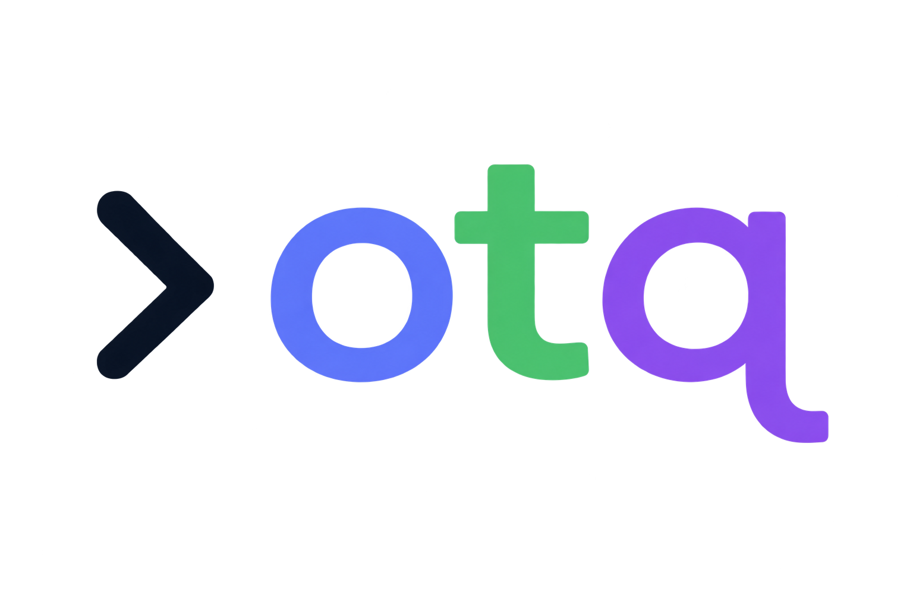

<p align="center">
  
</p>

# otq

A `jq`-like CLI for querying OpenTelemetry GenAI trace exports, offline. No backend, no server — point it at OTLP JSON/JSONL files and pipe a `jq`-inspired pipeline query over spans.

`otq` treats GenAI semantic-convention attributes (`gen_ai.*`) as first-class fields — model, tokens, prompt/completion messages, tool calls — instead of opaque attribute strings you'd otherwise have to dig out of raw `jq` against nested OTLP JSON.

## Getting started

### Install a release binary

Download the archive for your platform from the [Releases page](https://github.com/ChatIntel/otq/releases), extract, and put `otq` on your `PATH`. (No Homebrew tap yet — direct download for now.)

```sh
tar xzf otq_<version>_<os>_<arch>.tar.gz
sudo mv otq /usr/local/bin/
otq --version
```

(`.zip` for Windows.)

### Build from source

Prerequisite: Go 1.22+

```sh
go build -o otq ./cmd/otq
```

### Usage

```sh
otq [flags] QUERY PATH...
```

- `QUERY` — a pipeline query, e.g. `'spans | select(.name == "gen_ai.chat") | limit(10)'`
- `PATH` — one or more OTLP `.json`/`.jsonl` files, directories, or glob patterns

Flags:

- `--raw` / `-r` — raw string output for scalar string results (no surrounding quotes), matches `jq -r`
- `--pretty` — multi-line indented JSON per value

### Examples

Slowest `gen_ai.chat` spans:

```sh
otq 'spans | select(.name == "gen_ai.chat") | sort_by(.duration_ms, desc) | limit(10)' trace.json
```

Reconstruct a conversation from one trace, in order, and pipe into real `jq`:

```sh
otq 'spans | select(.trace_id == "abc123") | select(.name | startswith("gen_ai"))
      | sort_by(.start_time)
      | project({ role: .gen_ai.system, prompt: .gen_ai.prompt, completion: .gen_ai.completion })' trace.json \
  | jq -r '.role'
```

Default output is JSONL (one JSON value per line, no wrapping array), so `otq ... | jq ...` composes exactly like piping two `jq` calls together.

Token spend per model:

```sh
otq 'spans | select(.gen_ai.request.model != null)
      | group_by(.gen_ai.request.model)
      | project({ model: .group_key, total_tokens: sum(.gen_ai.usage.output_tokens), calls: count })' trace.json
```

`group_by` buckets spans in first-occurrence order (not sorted) — chain `sort_by(.group_key)` afterward if you want a specific order, since the bucket generically exposes `.group_key`/`.spans` to every later stage. Aggregation functions (`sum`/`avg`/`max`/`p95`/`count`) are only valid as `project({...})` field values after a `group_by` stage; `avg`/`max`/`p95` return `null` on a bucket with no numeric values at that path (never an error), `sum`/`count` are always well-defined (`0` on empty).

Traces containing an errored tool call:

```sh
otq 'traces | select(any(.spans; .gen_ai.tool.name != null and .status.code == "ERROR"))' trace.json
```

Spans downstream of a slow step:

```sh
otq 'spans | select(.name == "retrieval" and .duration_ms > 500) | descendants' trace.json
```

Tree navigation (`children`, `descendants`, `parent`, `ancestors`, `root`) resolves parent/child relationships against the *entire* input span set, not whatever the stream has already been filtered down to — and applying a nav stage to multiple spans in the current stream de-duplicates the combined result by `span_id`, in first-occurrence order. `any(path; expr)`/`all(path; expr)` require `path` to resolve to an array (typically `.spans` under the `traces` source) — anything else is a field error, not a crash; `any` over an empty array is `false`, `all` over an empty array is `true` (vacuous truth).

## Input format

- OTLP JSON: a single `ExportTraceServiceRequest`-shaped file (`{"resourceSpans": [...]}`).
- OTLP JSONL: one complete `ExportTraceServiceRequest` per line (one export batch per line, not one span per line).
- A directory or glob pattern expands to every `.json`/`.jsonl` file found (non-recursive for directories); all matched files are parsed and merged into one span set before querying.

## GenAI dialect support

`otq` targets the OpenLLMetry/Traceloop indexed-attribute dialect (`gen_ai.prompt.N.content`/`.role`, `gen_ai.completion.N.*`) as primary. If that's absent, it falls back to the newer `gen_ai.input.messages`/`gen_ai.output.messages` semconv shape. If neither is detected, `gen_ai.prompt`/`gen_ai.completion` are `null` — no silent misparsing.

## Development

```sh
go build ./...
go test ./...
go vet ./...
```

## Contributing

See [CONTRIBUTING.md](CONTRIBUTING.md) for dev setup, branch/PR conventions, and code style.

## For coding agents

See [llms.txt](llms.txt) for a condensed reference (query language, flags, GenAI fields) meant for LLM/agent consumption.

## Releasing

Pushing a `v*.*.*` tag triggers `.github/workflows/release.yml`, which runs [GoReleaser](https://goreleaser.com) (`.goreleaser.yml`) to cross-compile `darwin`/`linux`/`windows` × `amd64`/`arm64`, archive, checksum, and publish a GitHub Release — no manual steps, no extra secrets (uses the workflow's built-in `GITHUB_TOKEN`).

To dry-run locally before tagging:

```sh
goreleaser release --snapshot --clean
```

## License

Apache-2.0 — see [LICENSE](LICENSE).
